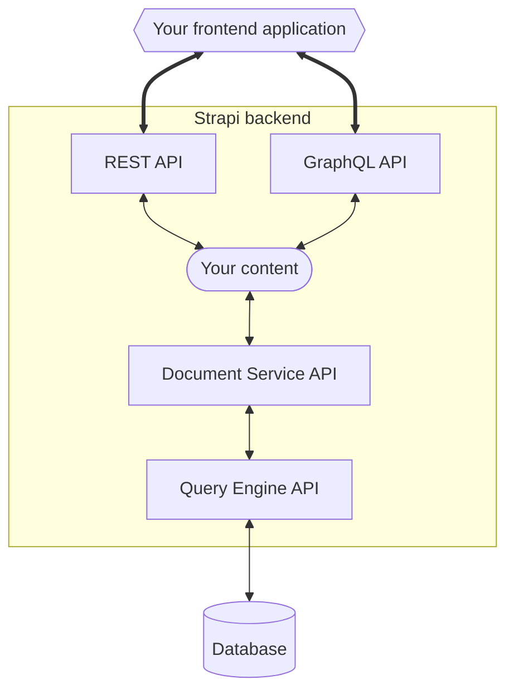

# Strapi APIを使ってコンテンツにアクセスする

Strapiプロジェクトを作成、設定し、[コンテンツタイプビルダー](/user-docs/content-type-builder)でデータ構造を作成し、[コンテンツマネージャー](/user-docs/content-manager)でデータを追加したら、コンテンツにアクセスしたいと思うでしょう。

フロントエンドアプリケーションからは、StrapiのコンテンツAPIを通じてコンテンツにアクセスできます。これは以下のように公開されています:
- デフォルトでは[REST API](/dev-docs/api/rest)を通じて
- また、Strapiの組み込みの[GraphQLプラグイン](/dev-docs/plugins/graphql)をインストールした場合は、[GraphQL API](/dev-docs/api/graphql)を通じてもアクセスできます。

RESTとGraphQLのAPIは、外部アプリケーションに公開されるコンテンツAPIの最上位層を表しています。また、Strapiは以下の2つの下位層のAPIも提供しています:

- [ドキュメントサービスAPI](/dev-docs/api/document-service)は、[バックエンドサーバー](/dev-docs/customization)内や[プラグイン](/dev-docs/plugins)を通じてアプリケーションのデータベースと対話するための推奨APIです。ドキュメントサービスは、**ドキュメント** <DocumentDefinition />やStrapiの複雑なデータ構造（コンポーネントやダイナミックゾーンなど）を処理する層です。
- クエリエンジンAPIは、データベース層とより低いレベルで対話し、データベースクエリの実行に使用されます。これはデータベース層への制限のない内部アクセスを提供しますが、Strapi 5が扱うことができる高度なStrapi機能（ドラフト＆パブリッシュ、国際化、コンテンツ履歴など）を認識していません。 ⚠️ ほとんどの場合、あるいは全ての場合において、ドキュメントサービスAPIを使用するべきです。

 

このドキュメンテーションのセクションには、以下のStrapi APIと、いくつかのサードパーティ技術との統合ガイドに関する参考情報が含まれています:

<CustomDocCardsWrapper>

<CustomDocCard emoji="↕️" title="REST API" description="RESTを通じてフロントエンドアプリケーションからコンテンツAPIをクエリします。" link="/dev-docs/api/rest" />

<CustomDocCard emoji="↕️" title="GraphQL API" description="GraphQLを通じてフロントエンドアプリケーションからコンテンツAPIをクエリします。" link="/dev-docs/api/graphql" />

<CustomDocCard emoji="🔃" title="ドキュメントサービスAPI" description="バックエンドサーバーやプラグインを通じてデータを問い合わせます。" link="/dev-docs/api/document-service" />

:::strapi インテグレーション
Strapiを他のプラットフォームと統合する方法を探している場合は、Strapiの[インテグレーションページ](https://strapi.io/integrations)を参照してください。
:::

</CustomDocCardsWrapper>