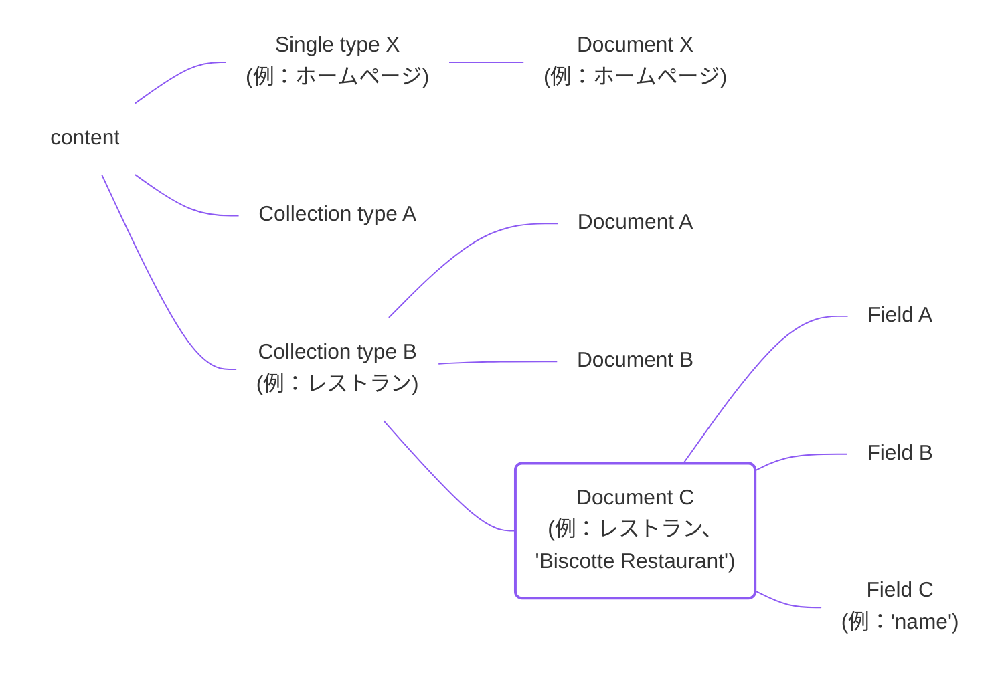
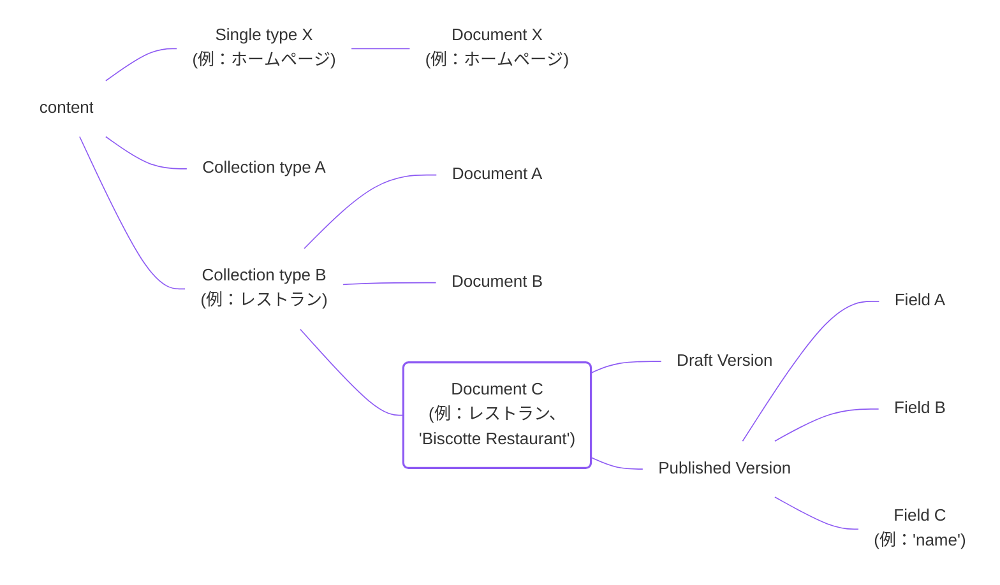
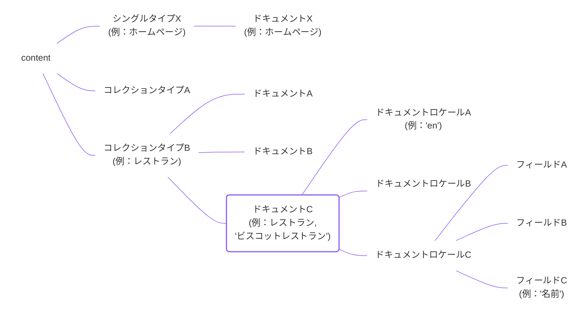
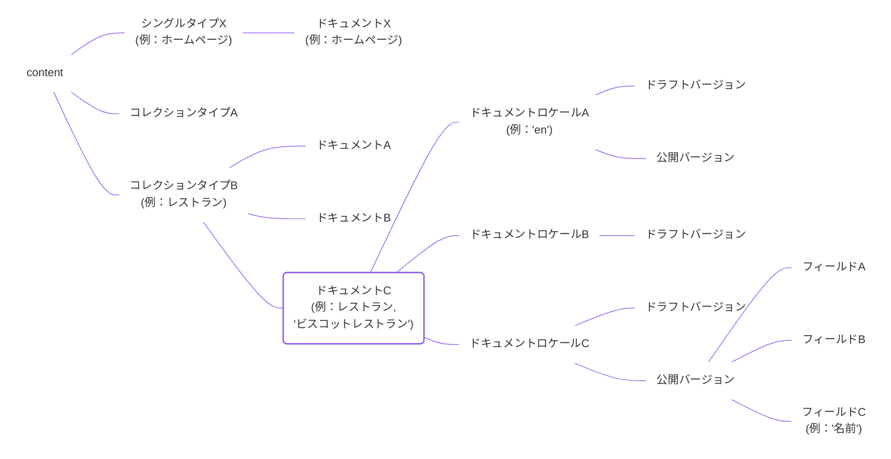

Strapi 5における**ドキュメント**はAPIのみの概念です。ドキュメントは、コンテンツタイプの特定のエントリーに対するコンテンツのさまざまなバリエーションを表します。

単一のタイプは一意のドキュメントを含み、コレクションタイプは複数のドキュメントを含むことができます。

管理パネルを使用するとき、ドキュメントの概念は決して言及されず、エンドユーザーにとっては必要ありません。ユーザーは[Content Manager](/user-docs/content-manager)で**エントリー**を作成および編集します。例えば、ユーザーとしては、特定のロケールのエントリーをリストしたり、特定のロケールの特定のエントリーの下書きバージョンを編集します。

しかし、APIレベルでは、エントリーのフィールドの値は実際には以下を持つことができます。

- 英語とフランス語のロケールで異なるコンテンツ、
- そして、それぞれのロケールで下書きと公開バージョンの異なるコンテンツ。

すべての下書きと公開バージョンのコンテンツを含むバケットはドキュメントです。

[Document Service API](/dev-docs/api/document-service)を使ってドキュメントを操作すると、ドキュメントを作成、取得、更新、削除したり、その中の特定のデータのサブセットを操作したりするのに役立ちます。

次の図は、コンテンツタイプに対してどの機能が有効化されているかによって、コンテンツの可能なバリエーションを全て表しています。例えば、[国際化（i18n）](/user-docs/content-manager/translating-content)や[下書き＆公開](/user-docs/content-manager/saving-and-publishing-content)などの機能が有効になっている場合：

<Tabs>
<TabItem value="document-only" label="i18nもDraft & Publishも無効">

</TabItem>

<TabItem value="dandp-only" label="Draft & Publishのみ有効">

</TabItem>

<TabItem value="i18n-only" label="i18nのみ有効">

</TabItem>

<TabItem value="i18n-and-dandp" label="i18n + 下書き＆公開が有効" default>

</TabItem>
</Tabs>

- 国際化（i18n）機能が有効化されている場合
コンテンツタイプで有効化されている場合、ドキュメントは複数の**ドキュメントロケール**を持つことができます。
- 下書き＆公開機能がコンテンツタイプで有効化されている場合、ドキュメントは**公開版**と**下書き版**を持つことができます。

:::strapi ドキュメントデータを問い合わせるAPI
ドキュメントやそれらが表現するデータとやり取りするには：

  - バックエンドサーバーから（例えば、コントローラー、サービス、プラグインのバックエンド部分から）[Document Service API](/dev-docs/api/document-service)を使用します。
  - アプリケーションのフロントエンド部分から、データを[REST API](/dev-docs/api/rest)または[GraphQL API](/dev-docs/api/graphql)を使用して問い合わせます。

APIに関する追加情報については、[Content API introduction](/dev-docs/api/content-api)を参照してください。
:::

:::info 返される結果のデフォルトバージョン
バックエンドAPIとフロントエンドAPIの重要な違いは、パラメータが渡されない場合に返されるデフォルトのバージョンに関するものです：
- Document Service APIはデフォルトで下書きバージョンを返します,
- 一方、RESTとGraphQLのAPIはデフォルトで公開バージョンを返します。
:::

