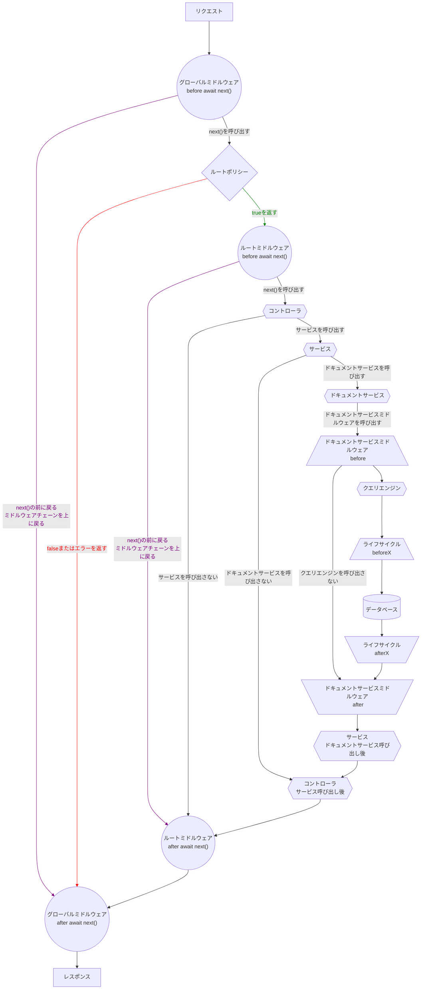

:::strapi 曖昧さ解消: Strapiのバックエンド
ヘッドレスCMSとして、Strapiソフトウェア全体をあなたのウェブサイトやアプリケーションの"バックエンド"と考えることができます。
しかし、Strapiソフトウェア自体には2つの異なる部分が含まれています：

- Strapiの**バックエンド**部分は、Strapiが実行するHTTPサーバーです。任意のHTTPサーバーと同様に、Strapiのバックエンドはリクエストを受け取り、レスポンスを送信します。あなたのコンテンツはデータベースに保存され、Strapiのバックエンドはデータベースと対話してコンテンツを作成、取得、更新、削除します。
- Strapiの**フロントエンド**部分は、管理パネルと呼ばれます。管理パネルは、コンテンツの構造化と管理を支援するためのグラフィカルユーザーインターフェースを提供します。

この開発者向けドキュメンテーション全体で、'バックエンド'は_Strapiのバックエンド部分だけ_を指しています。

[User Guide](/user-docs/intro)では、管理パネルの使用方法と、[管理パネルのカスタマイズセクション](/dev-docs/admin-panel-customization)では、管理パネルのさまざまなカスタマイズオプションについて詳しく説明しています。
:::

Strapiのバックエンドは、バックエンドJavaScriptフレームワークの[Koa](https://koajs.com/)を基にしたHTTPサーバーを実行します。

任意のHTTPサーバーと同様に、Strapiのバックエンドはリクエストを受け取り、レスポンスを送信します。[REST](/dev-docs/api/rest)または[GraphQL](/dev-docs/api/graphql)APIを通じて、Strapiのバックエンドにデータの作成、取得、更新、削除のリクエストを送信することができます。

リクエストは、Strapiのバックエンドを通じて以下のように行き来することができます：

1. Strapiサーバーは[リクエスト](/dev-docs/backend-customization/requests-responses)を受け取ります。
2. リクエストは、順序に従って実行される[グローバルミドルウェア](/dev-docs/backend-customization/middlewares)にヒットします。
3. リクエストは[ルート](/dev-docs/backend-customization/routes)にヒットします。 デフォルトでは、Strapiは作成したすべてのコンテンツタイプのルートファイルを生成し（[REST APIドキュメンテーション](/dev-docs/api/rest)を参照）、さらにルートを追加し、設定することができます。
4. [ルートポリシー](/dev-docs/backend-customization/policies)は、ルートへのアクセスをブロックできる読み取り専用の検証ステップとして機能します。[ルートミドルウェア](/dev-docs/backend-customization/routes#middlewares)は、リクエストフローを制御し、リクエスト自体を変更してから前に進むことができます。
5. [コントローラー](/dev-docs/backend-customization/controllers)は、ルートに到達した後にコードを実行します。[サービス](/dev-docs/backend-customization/services)は、コントローラーで再利用できるカスタムロジックを構築するために使用できるオプションの追加コードです。
6. コントローラーとサービスによって実行されるコードは、データベースに格納されているコンテンツデータ構造の表現である[モデル](/dev-docs/backend-customization/models)と対話します。 モデルによって表現されるデータとの対話は、[ドキュメントサービス](/dev-docs/api/document-service)と[クエリエンジン](/dev-docs/api/query-engine)によって処理されます。
7. [ドキュメントサービスミドルウェア](/dev-docs/api/document-service/middlewares)を実装して、データがクエリエンジンに送信される前にデータを制御することができます。クエリエンジンもライフサイクルフックを使用できますが、データベースと直接対話する必要が絶対にある場合を除き、ドキュメントサービスミドルウェアを使用することをお勧めします。
7. サーバーは[レスポンス](/dev-docs/backend-customization/requests-responses)を返します。レスポンスは、ルートミドルウェアとグローバルミドルウェアを通じて戻ることができ、送信されます。

グローバルミドルウェアとルートミドルウェアの両方には非同期のコールバック関数、`await next()`が含まれています。ミドルウェアが返すものによって、リクエストはバックエンドを通じて短いまたは長いパスを通ることになります：

* ミドルウェアが何も返さない場合、リクエストはバックエンドの各コア要素（すなわち、コントローラー、サービス、およびデータベースと対話する他のレイヤー）を通過し続けます。
* ミドルウェアが`await next()`を呼び出す前に戻る場合、レスポンスはすぐに送信され、残りのコア要素はスキップされます。その後、同じチェーンを下って戻ります。

:::info
このセクションのページに記載されているすべてのカスタマイズはREST APIのみに適用されます。[GraphQLのカスタマイズ](/dev-docs/plugins/graphql#customization)はGraphQLプラグインのドキュメンテーションで説明されています。
:::

<!-- TODO: このコメントを解除するには、バックエンドの例のクックブックがv5に更新されるのを待ちます -->
<!-- :::tip 例から学ぶ
実例を読んで理解し、それらが実際のユースケースでどのように使用できるかを学ぶことを好むなら、[例のクックブック](/dev-docs/backend-customization/examples)セクションは、Strapiのバックエンドのカスタマイズがどのように機能するかを見る別の方法です。
::: -->

## インタラクティブな図

以下の図は、リクエストがStrapiのバックエンドを通過する方法を示しています。任意の形状をクリックすると、ドキュメンテーションの関連ページにジャンプします。

<!-- TODO: これをv5のバックエンド例の料理本を更新したらコメントアウト解除してください -->
<!-- :::tip 例から学ぶ
実際の使用例を読んで理解することを好む方は、[例の料理本](/dev-docs/backend-customization/examples)セクションもStrapiのバックエンドカスタマイズの動作を理解するための一つの視点です。
::: -->

## インタラクティブなダイアグラム

以下のダイアグラムは、リクエストがStrapiバックエンドを通過する方法を表しています。任意の形状をクリックすると、関連するドキュメンテーションのページにジャンプします。

