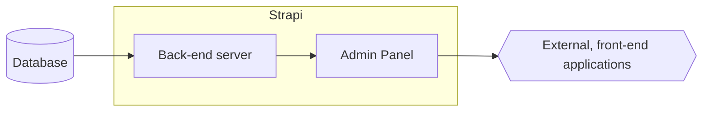

# カスタマイズ

Strapiには2つの主要なコンポーネントが含まれています:

- Strapiのバックエンド部分は、リクエストを受け取り、Content-Type BuilderとContent Managerを通じて構築および保存したデータを表面化するレスポンスを返す**サーバー**です。バックエンドサーバーについては、[バックエンドカスタマイズの紹介](/dev-docs/backend-customization)で詳しく説明しています。バックエンドサーバーのほとんどの部分はカスタマイズできます。

- Strapiのフロントエンド、ユーザー向け部分は**管理パネル**と呼ばれます。管理パネルは、データ構造を構築し、コンテンツを作成・管理し、組み込みまたはサードパーティのプラグインによって管理できるさまざまな他のアクションを実行するために使用するグラフィカルユーザーインターフェイス（GUI）です。管理パネルの一部はカスタマイズできます。

大きな視点から見ると、これがStrapiが典型的な、一般的なセットアップにどのように統合されるかです：Strapiには2つの部分、バックエンドサーバーと管理パネルが含まれており、データベース（データを保存する）と、データを表示する外部のフロントエンドアプリケーションと対話します。Strapiの両方の部分はある程度カスタマイズできます。

 

以下のカードのいずれかをクリックして、カスタマイズの可能性について詳しく学びましょう:

<CustomDocCardsWrapper>
<CustomDocCard emoji="" title="バックエンドのカスタマイズ" description="バックエンドサーバー（ルート、ポリシー、ミドルウェア、コントローラー、サービス、モデル）をカスタマイズします。" link="/dev-docs/backend-customization" />
<CustomDocCard emoji="" title="管理パネルのカスタマイズ" description="管理パネル（ロゴ、テーマ、メニュー、翻訳、その他）をカスタマイズします。" link="/dev-docs/admin-panel-customization" />
</CustomDocCardsWrapper>

:::info
データベースや外部のフロントエンドアプリケーションのカスタマイズは、現在のドキュメンテーションセクションの範囲外です。
- Strapiでのデータベースの使用については、インストールドキュメンテーションを読むことで詳しく学ぶことができます。これには、[サポートされるデータベース](/dev-docs/installation/cli#preparing-the-installation)がリストされており、設定ドキュメンテーションでは、プロジェクトとともに[データベースを設定する](/dev-docs/configurations/database)方法を説明しています。
- 外部のフロントエンドアプリケーションがStrapiとどのように対話できるかについては、Strapiの[統合ページ](https://strapi.io/integrations)を読むことで詳しく学ぶことができます。
:::
