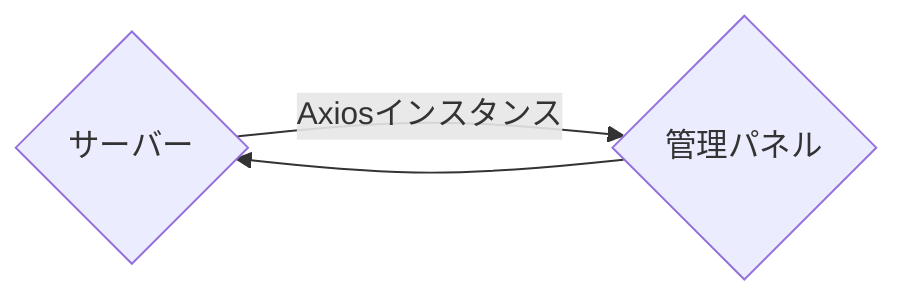

# サーバーから管理パネルにデータを渡す方法（Strapiプラグイン）

<NotV5 />

Strapiは**ヘッドレスCMS**です。管理パネルとサーバーは完全に分離されています。

[Strapiプラグインを開発しているとき](/dev-docs/plugins/developing-plugins)、サーバー側の`/server`フォルダから管理パネル側の`/admin`フォルダにデータを渡したい場合があります。`/server`フォルダではStrapiオブジェクトにアクセスでき、データベースクエリを実行できますが、`/admin`フォルダではそれができません。

サーバーから管理パネルにデータを渡すには、管理パネルのAxiosインスタンスを使用します。



サーバーから管理パネルにデータを渡すには、まず[カスタム管理ルートを作成](#create-a-custom-admin-route)し、その後[管理パネルでデータを取得](#get-the-data-in-the-admin-panel)します。

## カスタム管理ルートを作成する

管理ルートは、通常のコントローラー用ルートと似ていますが、`type: 'admin'`の宣言によって一般的なAPIルーターから隠され、管理パネルからアクセスできるようになります。

次のコードは、`my-plugin`プラグイン用のカスタム管理ルートを宣言します。

```js title="/my-plugin/server/routes/index.js"
module.exports = {
  'pass-data': {
    type: 'admin',
    routes: [
      {
        method: 'GET',
        path: '/pass-data',
        handler: 'myPluginContentType.index',
        config: {
          policies: [],
          auth: false,
        },
      },
    ]
  }
  // ...
};
```

このルートは、`/my-plugin/pass-data`エンドポイントにGETリクエストを送信した際に、`myPluginContentType`コントローラーの`index`メソッドを呼び出します。

次に、シンプルなテキストを返すカスタムコントローラーを作成します。

```js title="/my-plugin/server/controllers/my-plugin-content-type.js"
'use strict';

module.exports = {
  async index(ctx) {
    ctx.body = 'You are in the my-plugin-content-type controller!';
  }
}
```

これにより、`/my-plugin/pass-data`エンドポイントにGETリクエストを送信すると、`You are in the my-plugin-content-type controller!`というテキストがレスポンスとして返されます。

## 管理パネルでデータを取得する

`/my-plugin/pass-data`に定義したカスタムルートに対して管理パネルのコンポーネントからリクエストを送信すると、カスタムコントローラーから返されるテキストメッセージが取得されます。

例えば、`/admin/src/api/foobar.js`ファイルを作成し、次のコード例をコピーして貼り付けます。

```js title="/my-plugin/admin/src/api/foobar.js"
import axios from 'axios';

const foobarRequests = {
  getFoobar: async () => {
    const data = await axios.get(`/my-plugin/pass-data`);
    return data;
  },
};
export default foobarRequests;
```

これで、管理パネルのコンポーネントのコード内で `foobarRequests.getFoobar()` を使用して、`You are in the my-plugin-content-type controller!` というテキストをデータとして取得できるようになります。

例えば、Reactコンポーネント内で `useEffect` を使用して、コンポーネントが初期化された後にデータを取得する場合は、次のように記述します。

```js title="/my-plugin/admin/src/components/MyComponent/index.js"
import foobarRequests from "../../api/foobar";
const [foobar, setFoobar] = useState([]);

// …
useEffect(() => {
  foobarRequests.getFoobar().then(res => {
    setSchemas(res.data);
  });
}, [setFoobar]);
// …
```

これにより、コンポーネントの状態に `You are in the my-plugin-content-type controller!` というテキストが `foobar` データとして設定されます。
